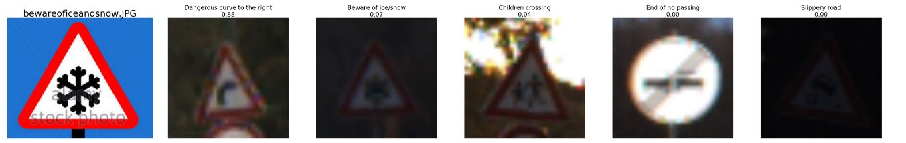
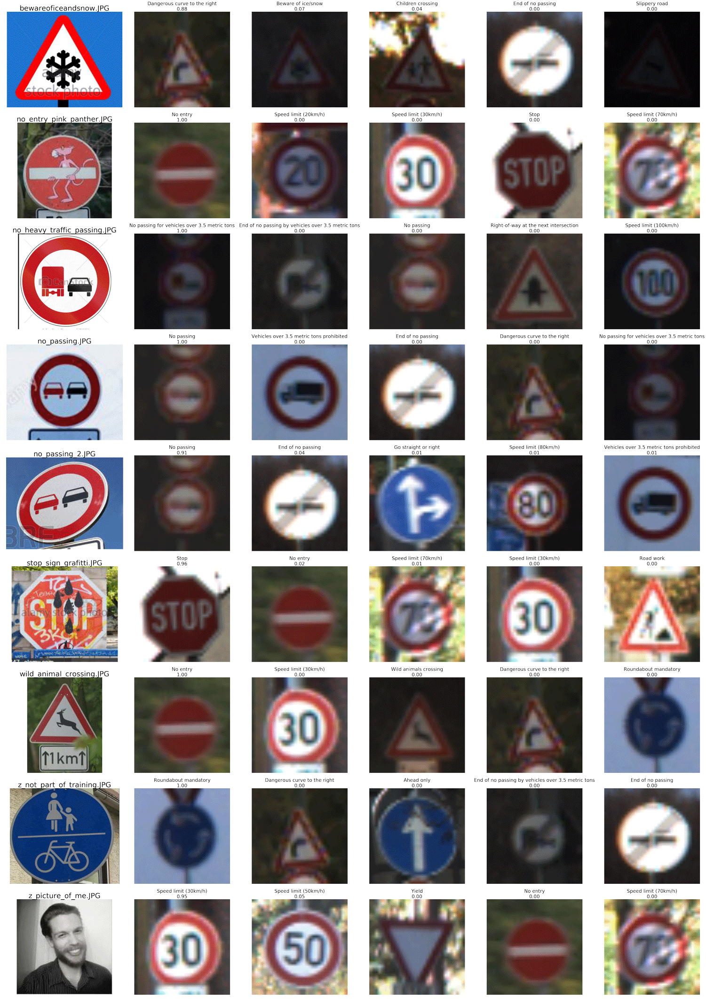

## Project: Build a Traffic Sign Recognition Program

[](http://www.udacity.com/drive)

## Overview


The goal is of this project is to construct a Convolutional Neural Network to classify German Traffic signs.

This ReadMe outlines the step of the project

- Data Set Summary & Exploration
- Design and Test a Model Architecture
- Analyze Testing Results
- Analyze Performance on novel German Traffic Signs

## Data Set Summary & Exploration

I wanted to understand the data that I was working with -- the shape, the values, etc.

```python
Number of training images = 34,799
Number of validation images = 4,410
Number of testing images = 12,630
Shape of image = (32, 32, 3)
Number of classes = 43
```

### Data Set Visualization

Here is a histogram of all of the images that the model will be trained on. Looking at this is important because having a skewed or disproportionate data set will most likely skew the model into biased predictions.


I randomly chose a handful of images and their corresponding sign label from the test set. Some reasons for doing this:

- Simply get a good overview of what you have to work with
- View the resolution, color, size, darkness, etc.
- Spot any outliers or unmatched signs
- Notice any features that you can take advantage of (color, shape, symbol complexity, etc.)


## Design and Test a Model Architecture

My model architecture of choice is the popular [LeNet-5](https://en.wikipedia.org/wiki/Convolutional_neural_network#LeNet-5) convolutional neural network first created by Yann LeCunn et al. It's popular for working with 'small' images in that it's designed for handwritten digit classification like zip codes or numbers in check books. This architecture appeared appropriate as traffic signs are composed of simple abstractions like shapes, symbols, numbers, etc. Specifically, the number of feature maps in the LeNet-5 model appeared to be appropriate as traffic signs may most likely only benefit from a small, limited amount of feature maps given the simplicity of their shape, lines, numbers, etc.

The only image preprocessing I performed on the images was to normalize each pixel value as this is a common and necessary step when implementing gradient descent.

```python
norm_image = cv2.normalize(img, norm_img, alpha=-1, beta=1, norm_type=cv2.NORM_MINMAX, dtype=cv2.CV_32F)
```

I did not convert the images to grayscale and instead kept the images' color. As we'll see, the model appears to acknowledge the color of the image.

The model architecture allows for a 32x32 picture with three color channels as its input. The model's output is an array of logits, each element corrsponding to a traffic sign.

| Layer         | Description                                                            |
| ------------- | ---------------------------------------------------------------------- |
| Input         | 32x32x3 RGB image                                                      |
| Convolution   | Convolve the input image from 32x32x3 to 28x28x6                       |
| Activation    | RELU                                                                   |
| Max Pool      | Only select salient pixels. The matrix changes from 28x28x6 to 14x14x6 |
| Convolution   | Convolve the input image from 14x14x6 to 10x10x6                       |
| Activation    | RELU                                                                   |
| Max Pool      | Only select salient pixels. The matrix changes from 10x10x16 to 5x5x16 |
| Flatten       | Flatten the 5x5x16 matrix to an array length of 400                    |
| Fully Connect | Take input of 400 activations and output 100                           |
| Activation    | RELU                                                                   |
| Drop Out      | Kill off 50% of the neurons' activations                               |
| Fully Connect | Take input of 100 activations and output 84                            |
| Activation    | RELU                                                                   |
| Drop Out      | Kill off 50% of the neurons' activations                               |
| Fully Connect | Take input of 84 activations and output 43                             |

### Training the model

The ultimate output of the model (after Softmax is performed on the model's Logits) is an array of predicted probabilities one for each of the 43 traffic signs. Therefor the model is solving a classification problem. The calculated loss is perfomed with cross enotropy which is a way to compute how 'wrong' or 'off' the model's prediction is for classification scenarios. My optimizer of choice is [Adaptive Moment Estimation](https://www.quora.com/Can-you-explain-basic-intuition-behind-ADAM-a-method-for-stochastic-optimization) or ADAM. Why ADAM? We don't want to use just Gradient Descent -- that would take too long. So we'll implement an approximate, but faster type called Stochastic Gradient Descent or SGD. ADAM is a type of SGD that takes advantage of its previous computed gradients in order to apply wiser, subsequent gradient calculations.

I configured my learning rate to be 0.001 -- a typical learning rate value.
My batch-size was dependent on my local computer's resources -- a batch size of a 128 images worked well.
The number of epochs I settled with is 6. For example, that's akin to watching season two of House of Cards six times. Each time you watch the same season (collection of data) you may get a deeper enjoyment with each successive viewing (a lower calculated loss / higher validation accuracy / well-adjusted weights) but watch the season too many times and you'll plateau on your derived enjoyment (stuck at a constant validation accuracy / overfitting on the training data / weights that are too attuned to the training data).

## Analyze Testing Results

I split up the corpus of German traffic sign images into training, validation, and testing sets. The calculations for the following accuracies are located in the notebook section: **Calculate and Display Accuracies**
Here's how the model performed after being trained:

| Image Set  | Number of Images | Overall Accuracy |
| ---------- | ---------------- | ---------------- |
| Training   | 34,799           | 98.89%           |
| Validation | 4,410            | 93.51%           |
| Test       | 12,630           | 92.28%           |

I originally setup a basic implmentation of the LeNet-5 architecture (page 7 on LeCunn et al paper [Gradient-Based Learning Applied to Document Recognition](http://yann.lecun.com/exdb/publis/pdf/lecun-01a.pdf)). This implmentation included nearly all aspects of my final model design. After training the basic implmentation of the LeNet-5 model, my validation accuracy peaked in the upper 80 percent -- a nice start but not sufficient for the minimum 93%. I began tuning certain hyperparameters: I added two drop-out layers after the first two fully connected layers. Each drop-out layer omitted 50% of the previous layers' activations from going to the next layer. The model performed better by reliably getting a validation accuracy in the low 90 percent -- still a bit shy of 93%. With such a positive accuracy increase I realized the model was originally too attuned to the training images. However, with the new drop-out layers the model may not be trained enough so I increased the number of epochs to six, from my original amount of three. Now my model achieved a validation accraucy of 93.51%. The relatively high training set accruacy of 98.89% is expected as the model was tested on the very images it trained. The test set, a group of images that the model never saw during training or validation, had a final accruacy of 92.28%. This accuracy is appropriately close to the validation set accuracy as the model did not train on either sets of images. In addition, the testing set accuracy is lower than the validation set's most likely because I did not subsequently change/tune the model in order to acheive a better accuracy.

## Analyze Performance on novel German Traffic Signs

I grabbed seven German traffic signs from Google's image search. By choosing signs with graffiti I can see how this may bend the perception of the model. I also chose a sign that had an auxiliary, rectangular sign below directly below it -- an additional trait the model was not trained on.


The model scored an overall accuracy of **71.43%** on these seven test images. Let's explore possible explanations as to why this score is much lower than the corpus' test set of **92.28%**

- The sample size is small with only seven images. That means that one image accounts for over 14 percentage points (a large step). The model classified five traffic signs correctly and two incorrectly.

- The sign **Beware of Ice/Snow** contains a relatively complex snowflake symbol. The network's top three prediction include the shape and outline of the sign, but the model failed to determine what exactly was in the sign's center. The shape is too intricate; this might be evidence that the network architecture is not robust enough to handle complex symbols.



- As noted previously, I included a traffic sign that the model did indeed train on, however, as is common with traffic signs, there is an additional, smaller rectangular sign directly below it. It appears the model mistook this small, white rectangular shape to mean **No Entry** rather than the correct **Wild Animals Crossing**.


- The model appears acute enough to detect large and small vehicle shapes within each sign. This is evident with the **No Passing for Vehicles over 3.5 Metric Tons**. The model even follows our own intuition with its next best guesses as **End of No Passing by Vehicles over 3.5 Metric Tons** and **No Passing**.


- Even when an image is taken from an angle, like with **No Passing**, the model picks out the round shape, the white background, and the two car shapes. Interestingly enough, the model is slightly reluctant in its decision as it gives some possibility that the sign is **End of No Passing**.


- The model appears to ignore defaced traffic signs and treats extra markings as noise.


Below are the rest of the model's predictions. The layout goes like this:

```
--------------------------------------------------------
<test image 1> | <1st prediction> | <2nd prediction> ...
--------------------------------------------------------
<test image 2> | <1st prediction> | <2nd prediction> ...
--------------------------------------------------------
<test image 3> | <1st prediction> | <2nd prediction> ...
--------------------------------------------------------
.
.
.
```

Note the bottom two rows. Of these rows, the first sign -- with the pedestrians and bicycle -- was never in the model's training set. Yet, the model acknowledged features of this sign -- blue, round, white markings -- and still predicted a confident score for a 'Mandatory Roundabout'. This shows a bad [recall](https://en.wikipedia.org/wiki/Precision_and_recall) as the model failed to prove that it is capable of observing false negatives which it could do by giving the sign a low probability.

The last image is a picture of myself. Haven't you ever wondered what German traffic sign you are?


